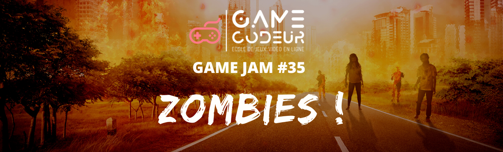
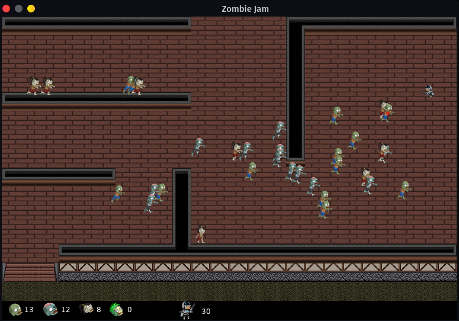
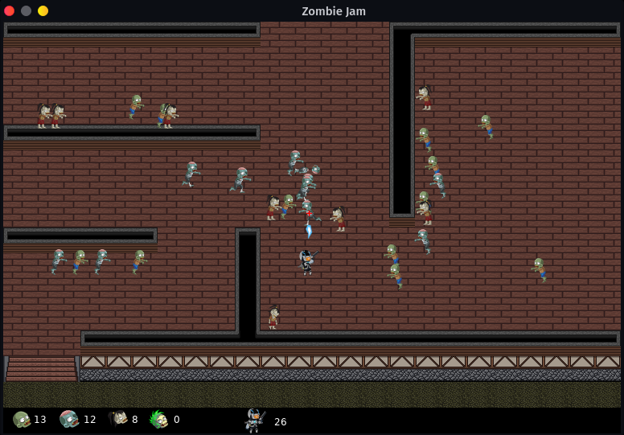
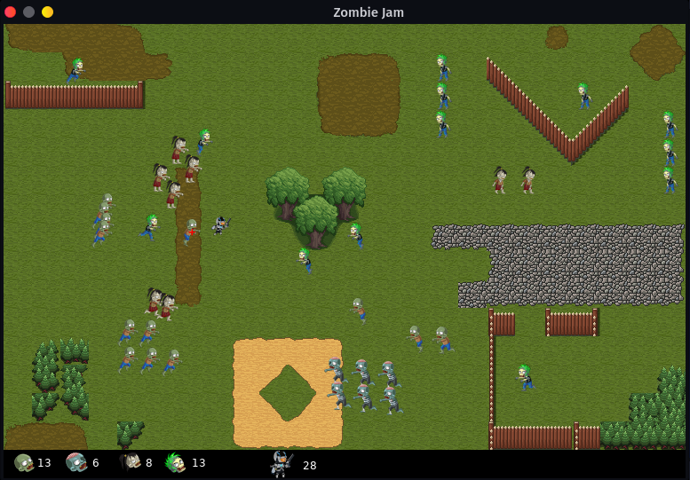
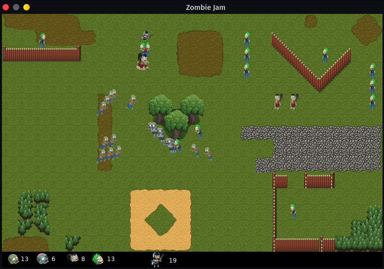
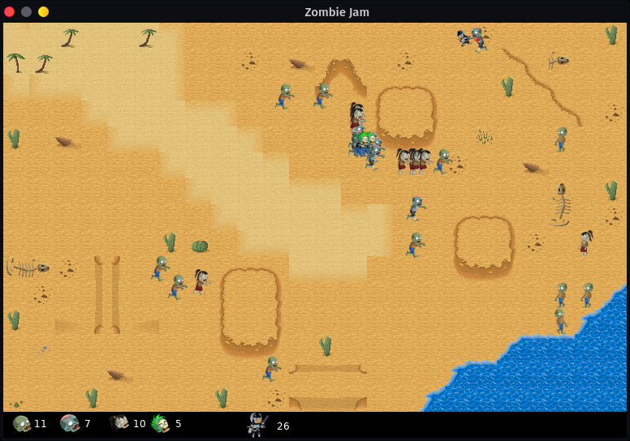
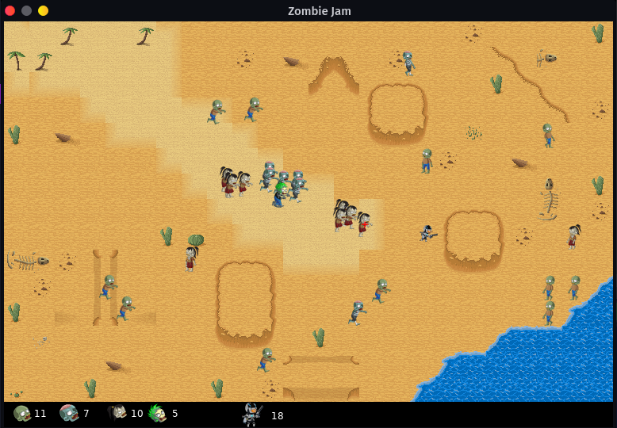

# Zombie Jam

Jeu réalisé à l'occasion de la [Gamecodeur Game Jam #35](https://itch.io/jam/gamecodeur-gamejam-35)

### Thème : Zombie
####  Sous - Theme : Comportements d'ennemis

### Langage / Framework utilisé : `Lua/Love 2d`

### Code par moi

### Graphisme :

- craftpix.net pour les personnages
- SRPG Studio Community Asset Project (SSCAP) pour les map
- Police : Kenney Future Narrow (kenney.nl)

### Temps passé :  16h 40min

### Post mortem :

Le langage Lua est fascinant. Il est d'une telle simplicité et en même temps d'une telle efficacité... Il me me permet de me concentrer sur les fonctionnalités principales de mon jeu sans trop m'attarder à l'aspect technique.  Sa structure en table est une mine d'or pour tout développeur, il permet de coder simplement des trucs complexe, sa gestion des listes m'a permis de créer un jeu sans prise de tête.

J'ai beaucoup apprécié que, contrairement aux jeux JavaScript utilisant un canvas, je n'ai pas de soucis de performance quand j'effectue une rotation, un scale ou que j'affiche un sprite à une coordonnée avec des nombres à virgule.

Lua garde une place spéciale dans ma boîte à outils. Combiné à Löve 2d, je le trouve très adapté au développement de jeux vidéos.

### Contrôles:

Flèches de direction pour déplacer le héro

Espace pour tirer

### Captures d'écrans
#### Niveau 1

#### Niveau 2

#### Niveau 3

